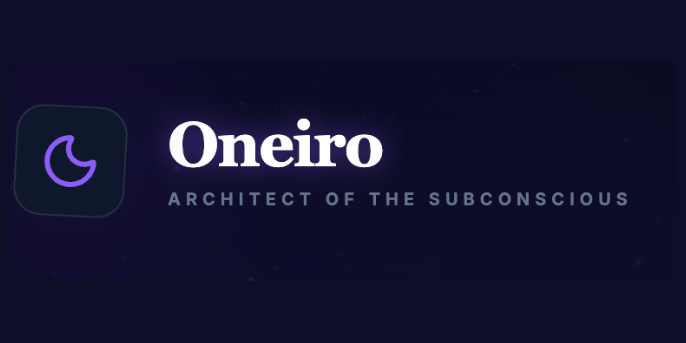

# Oneiro



Architect of the Subconscious — an atmospheric dream journal that transforms entries into visual memories, reveals recurring symbols, and charts your emotional landscape.

**Features**
- Dream journaling with cinematic image generation
- Memory Atlas: a living network of symbols, themes, and connections
- Insights dashboard for mood frequency and lucidity trends
- Local-first storage with automatic persistence

**Quick Start**
1. Install dependencies:
```
npm install
```
2. Create `.env.local` and add your Gemini API key:
```
API_KEY=your_key_here
```
3. Run the app:
```
npm run dev
```

**Scripts**
- `npm run dev` — start the local dev server
- `npm run build` — production build
- `npm run preview` — preview the production build locally

**Tech Stack**
- React + TypeScript + Vite
- D3 for the Memory Atlas
- Recharts for Insights
- Google Gemini for analysis and imagery

**Project Structure**
- `/components` — UI components (DreamInput, DreamCard, Atlas, Insights)
- `/services` — Gemini integration
- `/types.ts` — shared types

**Notes**
- Your dreams are stored locally in the browser (localStorage).
- The Gemini API key is required for analysis and image generation.
